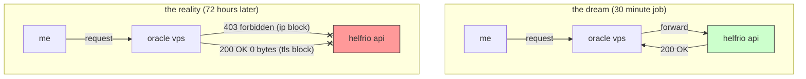
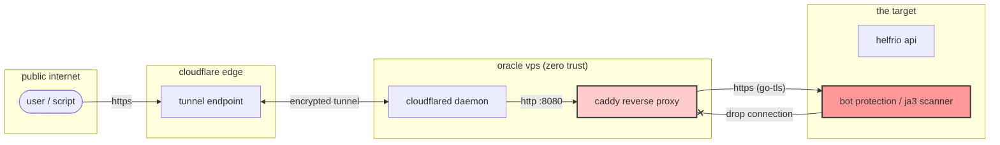
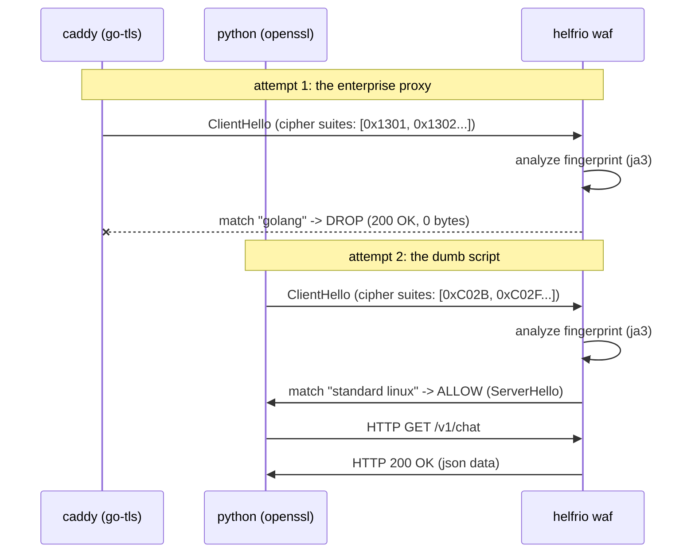
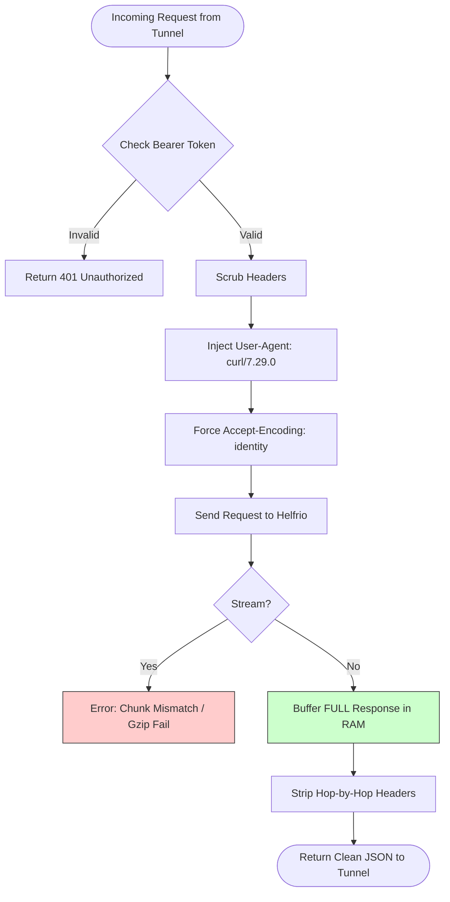
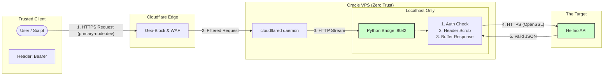

# Stealth Gateway: Defeating JA3 Fingerprinting with Python and Despair

**Date:** December 7, 2025
**Topic:** Network Engineering, Reverse Engineering, Zero Trust Security

---

### tl;dr
i spent more hours than id like to admit trying to configure a production-grade caddy reverse proxy on an oracle cloud arm64 potato. i fought selinux, iptables, and cloudflare tunnels. in the end, the target api blocked me anyway because it smelled the "go" language on my tls handshake. the solution? i threw the enterprise proxy in the trash and wrote a fifty-line python script that pretends to be `curl`. it works perfectly. i hate computers.

---

### the objective
it started with a problem i’m sure many of you have faced. i wanted to use a specific ai api - let's call it "**Helfrio**" (the upstream provider). they offer a generous free tier, but they have a strict limitation: they lock usage to a specific ip address. if i wanted to access it from my phone, my laptop at a cafe, or my home desktop, i was stuck playing whack-a-mole with the allowlist.

i had a spare oracle cloud vps sitting around collecting dust. it has a static ip. the plan seemed painfully simple. i would treat the vps as a "bridge."

**my initial logic:**
1.  i send a request to my vps.
2.  my vps forwards that request to Helfrio.
3.  Helfrio sees the vps ip (not my dynamic home ip) and sends the data back.



i thought this would take thirty minutes. install a proxy, open a port, and continue with the important stuff i had to do.
i was wrong.

what followed was a sleepless deep dive into the modern arms race of internet security. i didn't have to just build a proxy; i had to build a chameleon. this is how i (over)engineered a solution,and every wall i smashed my head against along the way.

### phase 1: the infrastructure nightmare
i started with the "correct" engineering approach. i chose caddy because it handles certificates automatically and is generally less painful than nginx. getting caddy onto an arm64 oracle linux 7 box, however, was my first mistake.

standard repositories for this architecture are a digital wasteland. `yum` failed. `dnf` failed. i ended up pulling static binaries from github like it was 2005, moving them to `/usr/local/bin`, and manually writing `systemd` unit files while questioning my life choices.

once the binary was alive, i hit the **firewall**. oracle cloud has three layers of firewalls because apparently, they assume everyone is trying to hack them (fair assumption).
1.  the oracle cloud security list (ingress rules).
2.  `firewalld` (or `iptables` depending on the mood of the os).
3.  selinux (the final boss).

instead of punching holes in the firewall and exposing port 443 to the scanner-infested internet, i opted for a **cloudflare tunnel**. this creates an outbound-only connection. the vps talks to cloudflare; the internet talks to cloudflare. zero open ports on the host. clean. secure. elegant.



### phase 2: the "dirty" ip
i fired up the tunnel. i pointed my domain `primary-node.dev` to my tunnel. i sent a test request via `curl`.

**HTTP 403 Forbidden.**

i checked the auth token. valid. i checked the endpoint. valid.
the issue was the car i drove up in. Helfrio subscribes to commercial threat intelligence feeds. oracle cloud's ip ranges are notoriously dirty - full of crypto miners and c2 servers. my ip reputation was trash before i sent a single byte.

**the countermeasure:**
the tunnel actually solved this. by routing through cloudflare, Helfrio sees a cloudflare edge ip, not my dirty oracle ip. i flushed the dns, retried, and...

**HTTP 403 Forbidden.**

### phase 3: header scrubbing
if the ip wasn't the issue, it had to be the headers. i was testing with python scripts and node.js. modern wafs (web application firewalls) are sensitive. if you send `User-Agent: python-requests/2.31.0` or `x-stainless-lang: js`, you are screaming "i am a bot."

i configured caddy to be a liar. i stripped the metadata headers. i forced the `User-Agent` to match a standard windows chrome browser string.

```nginx
header_up User-Agent "Mozilla/5.0 (Windows NT 10.0; Win64; x64)..."
header_up -x-stainless-*
header_up -X-Forwarded-For
```

i reloaded caddy. i held my breath. i sent the request.

**HTTP 200 OK.**

success? no. i looked at the response body.
`Content-Length: 0`.

the server shook my hand, smiled, and handed me an empty box. it knew i was lying.

### phase 3.5: the silent drop (tls fingerprinting)
this was the boss fight. i stared at the logs. `HTTP 200 OK`. `Content-Length: 0`.

why would a server send a success code but absolutely no data?

it turns out this is a sophisticated anti-scraping technique. Helfrio was not strictly looking at my headers; they were looking at the mathematical structure of my encryption handshake. this is known as **JA3 fingerprinting**.

when a client (like a browser or a script) connects to a secure server, it sends a `ClientHello` packet. this packet lists the cipher suites it supports, the tls versions it speaks, and the order of its extensions.
*   **chrome** has a specific, complex fingerprint.
*   **python (openssl)** has a standard, boring fingerprint.
*   **caddy (go crypto/tls)** has a very distinct, "i am a golang binary" fingerprint.

the conflict was obvious. my headers screamed "i am chrome on windows," but my ssl handshake screamed "i am a go program on linux." the provider saw the mismatch - the accent didn't match the costume - and silently dropped the connection to waste my time. instead of banning me (which gives me information), they ghosted me.



i realized i couldn't fix caddy's fingerprint without recompiling the entire server with obscure libraries like `utls`. i didn't have time for that.

but i knew one thing: **basic python scripts running directly on the vps worked.**
why? because python uses the system's standard OpenSSL library. its fingerprint looks exactly like a standard linux system tool - exactly what i was pretending to be.


### the exploit: the polyglot bridge
i made a radical architectural decision. i fired caddy from the job of talking to the upstream provider.

i decided to build a **"polyglot" architecture**.
1.  **caddy** (or the tunnel directly) handles the ingress. it takes the traffic from the internet.
2.  **python** handles the egress. i wrote a custom script to act as a relay.

the tunnel talks to python locally. python talks to Helfrio. because the final hop is made by python (OpenSSL), the fingerprint matches the `curl` User-Agent i was spoofing. the disguise was perfect.

i whipped up a `flask` script. i pointed the tunnel to port 8082. i ran the test.
**success.** data flowed.

until it didn't.

### phase 4: the protocol gap (the "empty box" glitch)
i thought i had won. i was getting json responses. but then, randomly, requests would fail. or worse, they would cut off halfway through.

**HTTP 502 Bad Gateway.**

the logs showed that the connection was resetting mid-stream. this was due to two specific hells inherent to the oracle cloud environment:

1.  **ipv6 routing:** oracle cloud tries to force ipv6. Helfrio's edge network had unstable routing for data center ipv6 connections. packets were falling into the void.
2.  **chunking errors:** modern apis send data in "chunks" (streaming). my simple python bridge was trying to stream the data back to the tunnel, but Helfrio was sending compressed (GZIP) data. the tunnel expected a stream but python gave it raw bytes, and the mismatch caused the pipe to break.

### the solution: the "nuclear" option
i stopped trying to be fancy. i stopped trying to be efficient. i optimized for pure, brute-force reliability.

i rewrote the bridge:
1.  **forced ipv4:** i disabled ipv6 system-wide on the vps kernel using `sysctl`.
2.  **identity encoding:** i forced the header `Accept-Encoding: identity`. this tells the upstream provider: "do not compress anything. send me raw text. i don't care about bandwidth."
3.  **no streaming:** i configured the bridge to download the *entire* response into memory first, verify it, and only then send it back to the client in one solid piece.



here is the code that finally punched through the wall. it’s not pretty, but it survives the hostile environment.

```python
from flask import Flask, request, Response
import requests
import os
import sys

app = Flask(__name__)

# config
UPSTREAM_URL = "https://api.helfrio.com"
REAL_KEY = os.environ.get("UPSTREAM_API_KEY")
MY_PASSWORD = "MY_SECRET_GATEWAY_PASSWORD"

@app.route('/<path:path>', methods=["GET", "POST", "PUT", "DELETE"])
def proxy(path):
    # 1. security check (poor man's firewall)
    client_auth = request.headers.get("Authorization", "")
    if MY_PASSWORD not in client_auth:
        return Response("unauthorized", 401)

    url = f"{UPSTREAM_URL}/{path}"
    
    # 2. the stealth headers
    # mimic a standard curl client to match the openssl fingerprint
    headers = {
        "Authorization": f"Bearer {REAL_KEY}",
        "User-Agent": "curl/7.29.0", 
        "Accept": "*/*",
        "Accept-Encoding": "identity", # vital: disable gzip to prevent chunking errors
        "Connection": "close"
    }
    
    # pass through content-type for json payloads
    if request.content_type:
        headers["Content-Type"] = request.content_type

    try:
        # 3. the nuclear request
        # stream=False forces the script to buffer the entire response.
        # this increases latency slightly but guarantees data integrity.
        resp = requests.request(
            method=request.method,
            url=url,
            headers=headers,
            data=request.get_data(),
            timeout=30,
            stream=False 
        )
        
        # 4. strip hop-by-hop headers
        # remove headers that confuse the cloudflare tunnel
        excluded_headers = ['content-encoding', 'content-length', 'transfer-encoding', 'connection']
        resp_headers = [(k, v) for (k, v) in resp.headers.items() 
                        if k.lower() not in excluded_headers]

        return Response(resp.content, resp.status_code, resp_headers)

    except Exception as e:
        return Response(str(e), 500)

if __name__ == "__main__":
    # listen on all interfaces (tunnel connects to localhost ip)
    app.run(host='0.0.0.0', port=8082)
```

### the final architecture
what started as a simple proxy is now a robust stealth gateway that is invisible to port scanners and indistinguishable from a standard client to the upstream provider. we moved from a simple "connect a to b" problem to a game of "who are you?" - spoofing headers, matching tls signatures, and managing ip reputation.



### security audit: is this safe?
you might wonder if creating a bridge like this leaves the server vulnerable. i asked myself the same question. strangely, this setup is **more secure** than a standard web server configuration.

**1. zero ingress (the invisible server)**
there are zero open ports on the server firewall. none.
i deleted every ingress rule in the oracle cloud console. you cannot port-scan it. you cannot ddos the ip directly. you cannot ssh in unless you are on my home ip (or via a separate tunnel). the only way data enters the box is through the authenticated cloudflare tunnel, initiated from the inside out.

**2. authentication (the bouncer)**
the python bridge enforces a custom "bearer token" password. even if someone guessed the random tunnel url, without my custom password, the script drops the connection instantly.
```python
if MY_PASSWORD not in client_auth:
    return Response("unauthorized", 401)
```
the real upstream api key is stored only in the `systemd` environment variables on the vps. it is never transmitted to the client.

**3. edge defense (geo-blocking)**
since i am the only user, i don't need the entire world accessing this. just the server where i will use this gateway. i configured cloudflare's waf to block traffic originating from nigeria, russia, israel, belarus, pakistan, burkina faso and vietnam; since im 100% none of the places where i will be using it depend on those. this eliminates a good chunk of global botnet scans before they even touch the tunnel.

### conclusion
i spent longer than i should've on what i thought would take 10 minutes, fighting modern internet security just to make a legitimate api call from a dynamic ip address.

this project highlighted that nowdays it is just as much about **identity** as it is about **connectivity**. the upstream provider didn't care that i had a valid certificate. they cared that my handshake looked "weird."

i tried to be professional with caddy. i failed. i succeeded by writing a python script that acts dumb, buffers data like it's 1999, and wears a `curl` user-agent mask.

sometimes, the most advanced security systems are defeated by simply using the default settings of the standard library.

***

### appendix: maintenance commands
for those following along, here is how we keep this monster alive.

**view live traffic logs:**
```bash
sudo journalctl -u helfrio-bridge -f
```

**restart the bridge:**
```bash
sudo systemctl restart helfrio-bridge
```

**verify the tunnel is healthy:**
```bash
sudo systemctl status cloudflared
```

**check local ports:**
```bash
sudo netstat -tulpn | grep python
```


### the troubleshooting hall of fame
building this wasn't a straight line; it was a drunken stumble through a minefield. for those brave (or foolish) enough to replicate this architecture, here is a catalog of the specific errors that nearly made me quit technology to become a galician goat farmer.

**1. the ghost response (200 ok, 0 bytes)**
*   **symptom:** your client gets a success code, but the response body is empty. logs show `Content-Length: 0`.
*   **cause:** this is the fingerprint blocker. Helfrio sees your golang/node/java tls handshake, decides you are a bot, and drops the connection logic without sending a tcp reset. it’s gaslighting as a service.
*   **fix:** stop using caddy/nginx for the upstream connection. switch to a python script using `requests` (openssl). mimicking the handshake is easier than recompiling your web server.

**2. the bad gateway (502)**
*   **symptom:** cloudflare returns a 502 error page.
*   **cause:** usually ipv6. oracle cloud loves ipv6. many upstream api providers claim to support it but actually route it through a potato. alternatively, it’s a chunked encoding mismatch where the tunnel tries to stream data faster than the python script can buffer it.
*   **fix:** disable ipv6 system-wide (`sudo sysctl -w net.ipv6.conf.all.disable_ipv6=1`). set `stream=False` in your python request to force a full download before forwarding.

**3. the forbidden door (403)**
*   **symptom:** immediate rejection with html content ("just a moment...").
*   **cause:** you leaked a header. you probably sent `x-stainless-lang` or `User-Agent: node-fetch`.
*   **fix:** audit your headers. send exactly three headers: `Authorization`, `Content-Type`, and `User-Agent: curl/7.29.0`. delete everything else. be minimal.

### faq: "why didn't you just..."

**...use a residential proxy service?**
because i am cheap. residential proxies cost money per gigabyte. oracle cloud is free. cloudflare tunnels are free. my time, apparently, is worthless.

**...use nginx?**
nginx is great until you need to configure it to act as a forward authenticating proxy with dynamic header stripping and automatic tls termination behind a tunnel. then it becomes xml-style torture. caddy was closer, but the go fingerprint killed it. python is the universal glue.

**...run this on a raspberry pi at home?**
i could have. but then i'm exposing my home ip to the tunnel (safe) or opening ports (unsafe). plus, the uptime of a vps is better than my home fiber connection. i also had to give some use to the unused vps i have had for years collecting dust.

### final thoughts
the internet is becoming a series of walled gardens guarded by algorithms that analyze not just *what* you say (your password), but *how* you say it (your tcp packet structure).

realistically i didnt even need this, as im already subscribed to multiple AI api providers, but it was something i wanted to give a try and see if it worked. its a proof of concept that with enough perseverance (and tcpdump), you can still traverse the hostile landscape of the modern web.

the code is ugly. the architecture is a hack. but when i send a request from my phone in a subway tunnel and get a valid json response from a locked-down enterprise api, it doesnt matter.

keep your headers clean and your ports closed.
